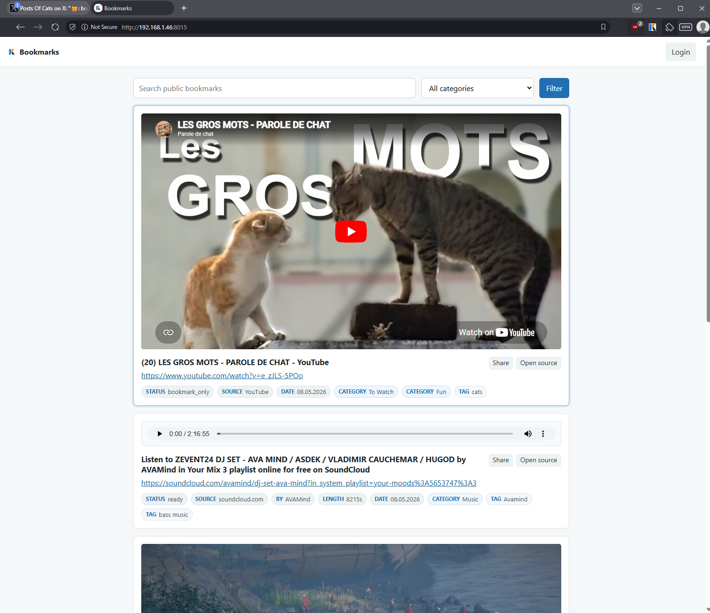
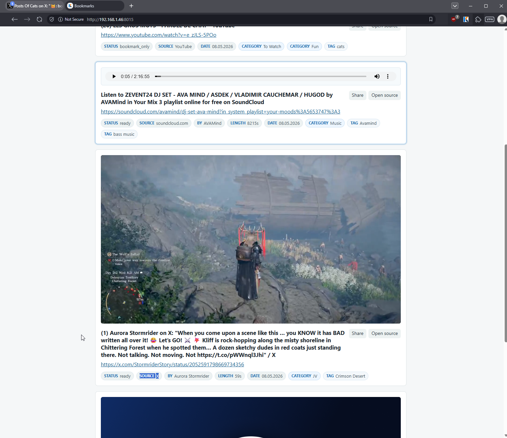
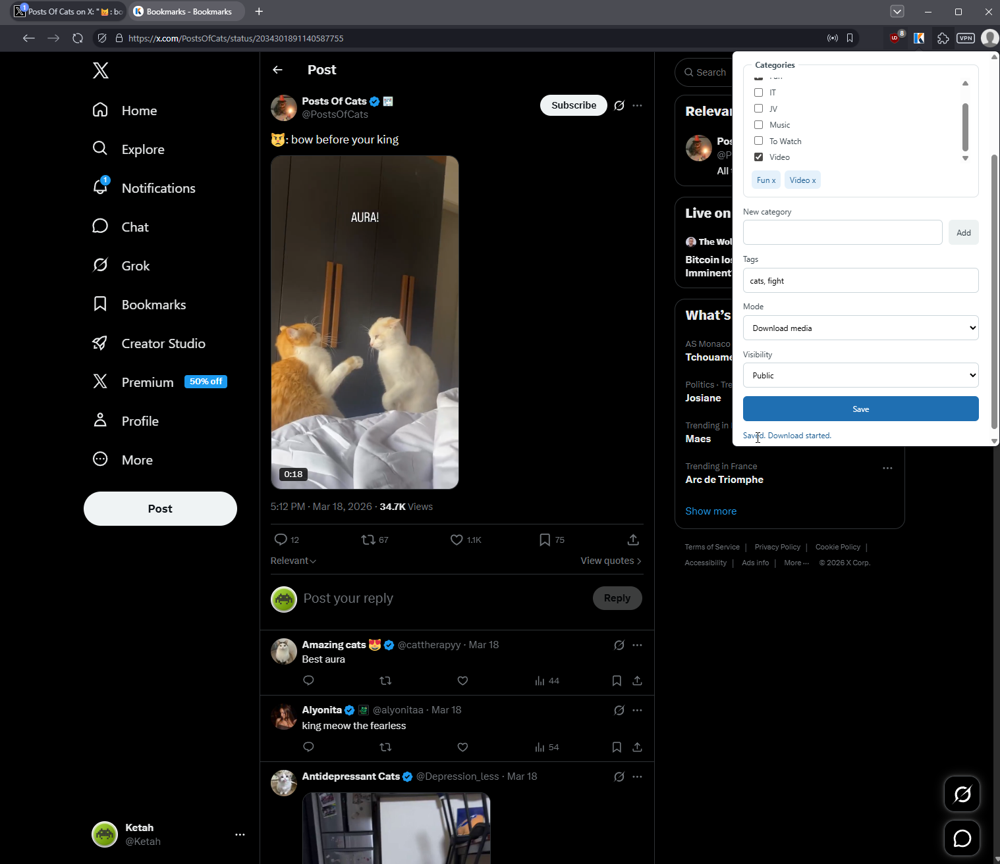
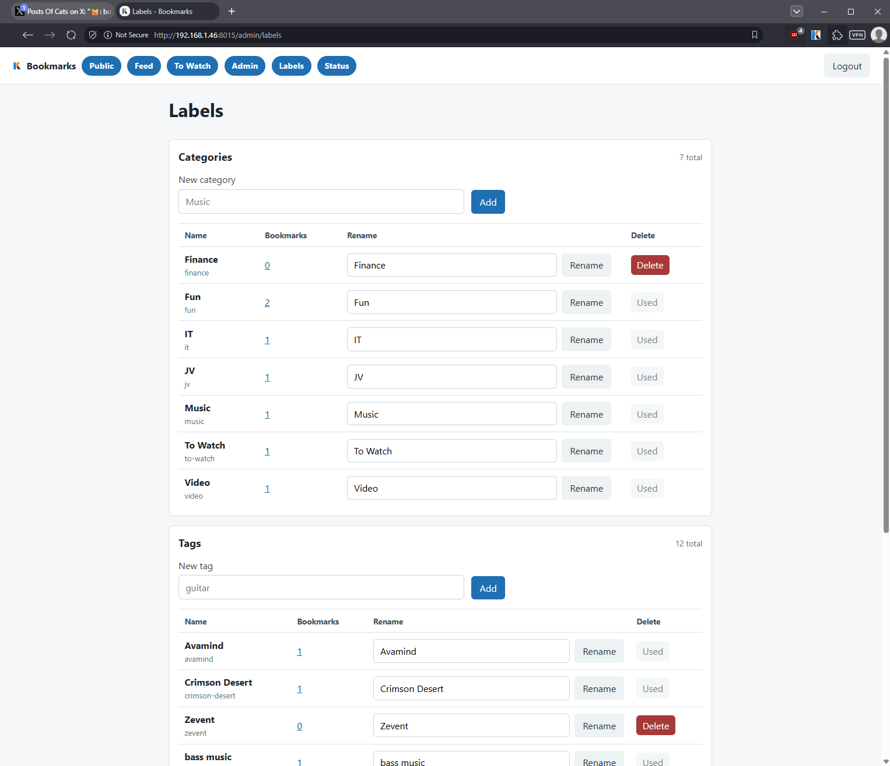
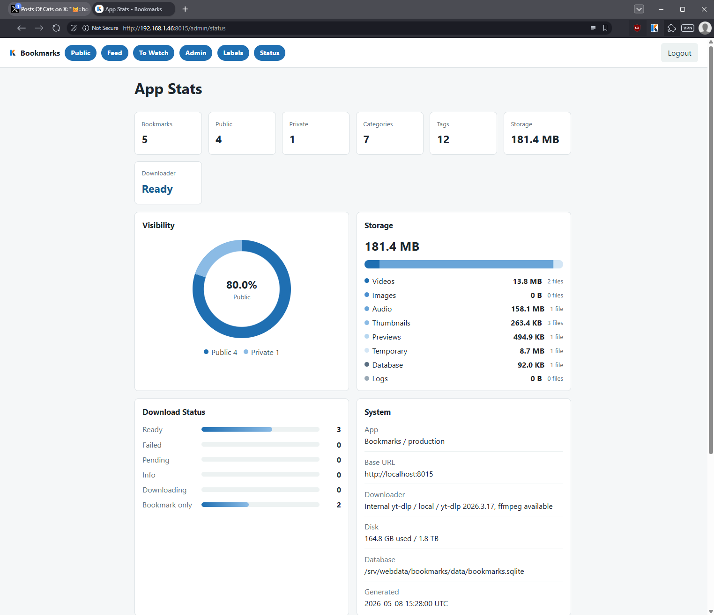

# Bookmarks

Bookmarks is a self-hosted, single-user bookmarking app for saving links, organizing them with categories and tags, and browsing them in a clean feed.

It can save simple bookmarks, embed bookmark-only YouTube links, enrich website bookmarks with Open Graph previews or screenshots, and download media with an internal `yt-dlp` downloader.

Built by Ketah with assistance from OpenAI Codex.

## Screenshots

### Public feed





### Browser extension



### Administration





## Features

- Single-user web UI with username/password login.
- API token authentication for browser extension/API use.
- Public/private bookmark visibility.
- Readonly public feed at `/`.
- Authenticated management feed at `/bookmarks`.
- Categories and tags.
- Exact category and tag filtering.
- To Watch workflow with a `Watched` action.
- Bookmark-only YouTube embeds.
- Website previews from Open Graph metadata or local screenshots.
- Optional media download through `yt-dlp`.
- Local media storage under `/srv/webdata/bookmarks`.
- JSON export/import.
- Admin bulk edit page.
- Label management page.
- App status page with storage charts.
- Chrome/Brave-compatible Manifest V3 extension.

## Status

This project is currently designed for **one trusted self-hosted user**. It is not a multi-user SaaS app.

Media download support is built in through `yt-dlp` and `ffmpeg`. ReClip-compatible downloads are still available as an optional fallback by setting `DOWNLOADER_BACKEND=reclip`.

## Quick Start

Clone the repository:

```bash
git clone https://github.com/erille/Bookmarks.git
cd Bookmarks
```

Create your environment file:

```bash
cp .env.example .env
nano .env
```

At minimum, set:

```text
BOOKMARKS_USERNAME=admin
BOOKMARKS_PASSWORD_HASH=<argon2id password hash>
BOOKMARKS_API_TOKEN=<long random token>
SESSION_SECRET_KEY=<long random secret>
```

For local HTTP testing, also set:

```text
SESSION_COOKIE_SECURE=false
APP_BASE_URL=http://localhost:8015
```

Generate random secrets:

```bash
openssl rand -hex 32
```

Generate an Argon2 password hash:

```bash
python -m venv .venv
. .venv/bin/activate
pip install -r backend/requirements.txt
python -c "from argon2 import PasswordHasher; import getpass; print(PasswordHasher().hash(getpass.getpass('Password: ')))"
```

Argon2 hashes contain `$` characters. In `.env`, wrap the generated hash in single quotes:

```text
BOOKMARKS_PASSWORD_HASH='$argon2id$v=19$m=65536,t=3,p=4$...'
```

Start the app:

```bash
docker compose up -d --build
```

Open:

```text
http://localhost:8015/login
```

## Storage

By default, Docker Compose mounts persistent data here:

```text
/srv/webdata/bookmarks
```

Expected layout:

```text
/srv/webdata/bookmarks/
  data/bookmarks.sqlite
  media/videos/
  media/images/
  media/audio/
  media/thumbnails/
  media/previews/
  media/tmp/
  logs/
```

Create it manually if needed:

```bash
sudo mkdir -p /srv/webdata/bookmarks/{data,media/videos,media/images,media/audio,media/thumbnails,media/previews,media/tmp,logs}
sudo chown -R $USER:$USER /srv/webdata/bookmarks
chmod 750 /srv/webdata/bookmarks
```

## Downloader

By default, Bookmarks downloads media internally:

```text
DOWNLOADER_BACKEND=internal
```

The internal downloader uses `yt-dlp` and `ffmpeg`, both installed in the Docker image. The default format prefers MP4-compatible media up to 720p:

```text
YTDLP_FORMAT=bestvideo[height<=720][ext=mp4]+bestaudio[ext=m4a]/best[height<=720][ext=mp4]/best[height<=720]/best
```

To use an existing ReClip-compatible service instead:

```text
DOWNLOADER_BACKEND=reclip
```

When Bookmarks runs in Docker and ReClip runs on the Docker host:

```text
RECLIP_BASE_URL=http://host.docker.internal:8899
```

When Bookmarks and ReClip run on the same host without Docker isolation:

```text
RECLIP_BASE_URL=http://127.0.0.1:8899
```

Bookmark-only saves do not use the downloader.

## Browser Extension

The extension lives in `extension/`.

To load it in Chrome or Brave:

1. Open `chrome://extensions` or `brave://extensions`.
2. Enable Developer mode.
3. Click `Load unpacked`.
4. Select the `extension/` directory.
5. Open extension options.
6. Set your Bookmarks base URL and API token.

Default local base URL:

```text
http://localhost:8015
```

The extension manifest allows HTTP and HTTPS self-hosted URLs so it can work with custom domains. If you want stricter browser permission prompts, edit `extension/manifest.json` and restrict `host_permissions` to your own Bookmarks URL before loading it.

## Useful Commands

Health check:

```bash
curl -s http://localhost:8015/health
```

View logs:

```bash
docker compose logs -f bookmarks
```

Dry-run orphan media cleanup:

```bash
docker exec bookmarks python -m app.cleanup --dry-run
```

Delete orphan media after reviewing the dry run:

```bash
docker exec bookmarks python -m app.cleanup --delete
```

Export metadata:

```bash
curl -s http://localhost:8015/api/export \
  -H "Authorization: Bearer $BOOKMARKS_API_TOKEN" \
  -o bookmarks-export.json
```

Import metadata:

```bash
curl -s -X POST "http://localhost:8015/api/import?overwrite=false" \
  -H "Authorization: Bearer $BOOKMARKS_API_TOKEN" \
  -H "Content-Type: application/json" \
  --data-binary @bookmarks-export.json
```

## Backup

Back up:

```text
/srv/webdata/bookmarks/data
/srv/webdata/bookmarks/media
/srv/webdata/bookmarks/.env
```

The JSON export stores metadata only. It does not contain video/image/preview files.

## Tech Stack

- FastAPI
- SQLite
- SQLAlchemy
- Jinja2
- Vanilla JavaScript
- yt-dlp
- ffmpeg
- Docker Compose
- Chrome Manifest V3 extension

## Roadmap Ideas

- Improve download queue/progress details.
- DB-backed setup/bootstrap flow.
- Admin-managed API tokens.
- Favorite/star bookmarks.
- Archive/hide bookmarks.
- Mobile/PWA share target.
- Optional multi-user mode.

## License

MIT
